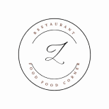

# 🌙 JEC Night Cafe

<div align="center">
  
  
  **✨ Where Every Dish Tells a Story and Every Moment Becomes a Memory ✨**
  
  [](https://jecnightcafe.vercel.app/)
  [](https://github.com/azfar-2/Jec-Night-Cafe)
  [](LICENSE)
  
</div>

---

## 🍽️ About JEC Night Cafe

**JEC Night Cafe** is a modern, full-stack restaurant website that brings the perfect blend of flavor and ambiance to your digital experience. Built with cutting-edge technologies, it offers an immersive dining experience through a beautifully crafted web interface.

> *"It's not just a place, it's a Vibe..."*

### 🌟 Key Features

- **🎨 Modern Design**: Stunning UI/UX with smooth animations and responsive design
- **📱 Mobile-First**: Fully responsive across all devices and screen sizes
- **🔥 Real-time Reservations**: Interactive booking system with MongoDB integration
- **⚡ Fast Performance**: Optimized for speed with Vite and modern React
- **🎯 Interactive Elements**: Engaging hover effects and smooth scrolling
- **🍕 Dynamic Menu**: Showcase of popular dishes with beautiful imagery
- **👥 Team Showcase**: Meet our passionate team members
- **📊 Statistics**: Live customer satisfaction metrics

---

## 🛠️ Tech Stack

### Frontend


### Backend


### Deployment & Tools


---

## 🚀 Quick Start

### Prerequisites
- Node.js (v16 or higher)
- npm or yarn
- MongoDB Atlas account

### 📦 Installation

1. **Clone the repository**
   ```bash
   git clone https://github.com/azfar-2/Jec-Night-Cafe.git
   cd Jec-Night-Cafe
   ```

2. **Install dependencies for both frontend and backend**
   ```bash
   # Install backend dependencies
   cd backend
   npm install
   
   # Install frontend dependencies
   cd ../frontend
   npm install
   ```

3. **Environment Setup**
   
   Create a `config.env` file in the `backend/config/` directory:
   ```env
   PORT=4000
   FRONTEND_URL=http://localhost:5173
   MONGO_URI=your_mongodb_connection_string
   ```

4. **Start the development servers**
   
   **Backend (Terminal 1):**
   ```bash
   cd backend
   npm run dev
   ```
   
   **Frontend (Terminal 2):**
   ```bash
   cd frontend
   npm run dev
   ```

5. **Access the application**
   - Frontend: `http://localhost:5173`
   - Backend API: `http://localhost:4000`

---

## 📁 Project Structure

```
JEC-Night-Cafe/
├── 📂 frontend/
│   ├── 📂 public/           # Static assets (images, icons)
│   ├── 📂 src/
│   │   ├── 📂 components/   # React components
│   │   │   ├── HeroSection.jsx
│   │   │   ├── Navbar.jsx
│   │   │   ├── Menu.jsx
│   │   │   ├── About.jsx
│   │   │   ├── Team.jsx
│   │   │   ├── Reservation.jsx
│   │   │   └── Footer.jsx
│   │   ├── 📂 Pages/        # Page components
│   │   ├── App.jsx          # Main App component
│   │   ├── App.css          # Global styles
│   │   └── restApi.json     # Static data
│   └── package.json
├── 📂 backend/
│   ├── 📂 config/          # Environment configuration
│   ├── 📂 controller/      # Route controllers
│   ├── 📂 database/        # Database connection
│   ├── 📂 error/          # Error handling
│   ├── 📂 models/         # MongoDB schemas
│   ├── 📂 routes/         # API routes
│   ├── app.js             # Express app setup
│   ├── server.js          # Server entry point
│   └── package.json
└── README.md
```

---

## 🎯 Features Showcase

### 🌟 Hero Section
- **Animated gradient background** with floating elements
- **Interactive parallax scrolling** effects
- **Call-to-action buttons** with smooth scroll navigation
- **Statistics showcase** (500+ customers, 50+ dishes, 5★ rating)

### 🍕 Menu Section
- **Dynamic dish display** with hover animations
- **Category-based filtering** (Breakfast, Lunch, Dinner)
- **High-quality food imagery** with smooth transitions

### 📅 Reservation System
- **Real-time booking** with form validation
- **MongoDB integration** for data persistence
- **Success/Error handling** with toast notifications
- **Responsive form design** across all devices

### 👥 Team Section
- **Interactive team member cards** with hover effects
- **Professional team showcase** (Founder, Manager, Developer, Tester)
- **Smooth animations** and engaging user interactions

---

## 📊 API Endpoints

### Reservation Routes
```
POST /api/v1/reservation/send
```
**Request Body:**
```json
{
  "firstName": "John",
  "lastName": "Doe",
  "email": "john@example.com",
  "phone": "1234567890",
  "date": "2024-01-15",
  "time": "19:30"
}
```

---

## 🎨 Design Highlights

- **Modern Glassmorphism UI** with blur effects
- **Smooth animations** and micro-interactions
- **Responsive grid layouts** for all screen sizes
- **Custom CSS animations** and keyframes
- **Professional color scheme** with gradient overlays
- **Typography optimization** with Google Fonts (Oswald)

---

## 🌐 Live Demo

**Frontend:** [jecnightcafe.vercel.app](https://jecnightcafe.vercel.app/)  
**Backend API:** [jecnightcafe-backend.vercel.app](https://jecnightcafe-backend.vercel.app/)

---

## 👥 Team

<table>
  <tr>
    <td align="center">
      <br>
      <b>Nitish Jha</b><br>
      <i>Founder</i>
    </td>
    <td align="center">
      <br>
      <b>Azfar Alam</b><br>
      <i>Manager</i>
    </td>
    <td align="center">
      <br>
      <b>Manikant Singh</b><br>
      <i>Developer</i>
    </td>
    <td align="center">
      <br>
      <b>Sachin Singh</b><br>
      <i>Tester</i>
    </td>
  </tr>
</table>

---

## 🔧 Development Scripts

### Frontend
```bash
npm run dev      # Start development server
npm run build    # Build for production
npm run preview  # Preview production build
npm run lint     # Run ESLint
```

### Backend
```bash
npm start        # Start production server
npm run dev      # Start development server with nodemon
```

---

## 📝 License

This project is licensed under the MIT License - see the [LICENSE](LICENSE) file for details.

---

## 🤝 Contributing

We welcome contributions! Please follow these steps:

1. Fork the repository
2. Create a feature branch (`git checkout -b feature/AmazingFeature`)
3. Commit your changes (`git commit -m 'Add some AmazingFeature'`)
4. Push to the branch (`git push origin feature/AmazingFeature`)
5. Open a Pull Request

---

## 📞 Contact

**Nitish Jha** - Founder & Lead Developer
- 📧 Email: nitishjha525@gmail.com
- 🌐 Website: [JEC Night Cafe](https://jecnightcafe.vercel.app/)
- 📍 Location: Jaipur, Rajasthan (302028)

---

## 📈 Project Stats

- **⭐ GitHub Stars:** 
- **🔀 Forks:** 
- **📝 Commits:** 
- **📊 Code Size:** 

---

<div align="center">
  <h3>🌟 If you found this project helpful, please give it a star! ⭐</h3>
  <p><i>Made with ❤️ by the JEC Night Cafe Team</i></p>
  
  **🚀 Ready to taste the difference? [Visit JEC Night Cafe](https://jecnightcafe.vercel.app/) 🚀**
</div>
